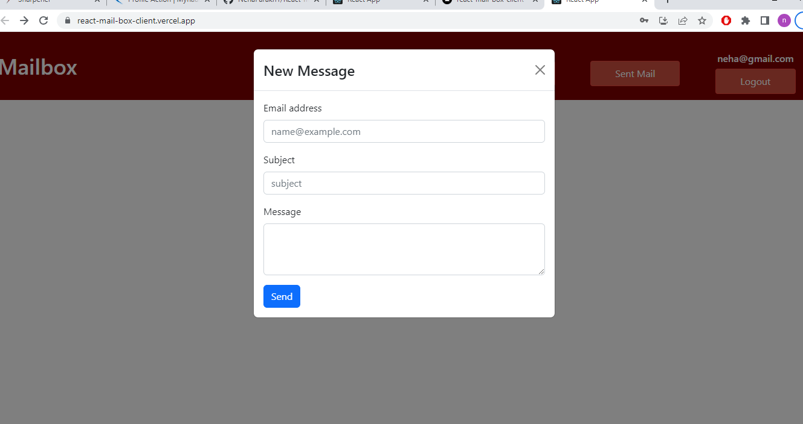
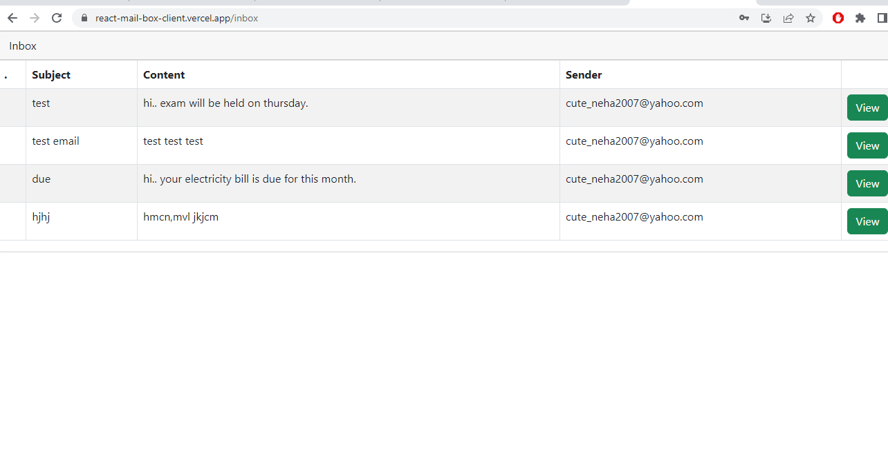

# React-mail-box-client

This is a Mailbox Client App built using React and Redux, designed for sending and receiving real-time user-specific emails.

# Features

1. The app enables users to send and receive emails in real-time, ensuring quick and efficient communication.
2. Each user has their own mailbox, allowing them to access their emails securely and privately.
3. Users can compose new emails, providing a seamless interface to draft and send messages to recipients.
4. Users receive notifications when they receive new emails, ensuring they stay informed and responsive.

# Technologies used

1. React
2. Redux
3. HTML
4. CSS
5. RESTful APIs

# Usage

1. Sign in with your credentials or create a new account if you don't have one.
2. Navigate through the app to access your inbox, compose and send emails, and manage your mailbox efficiently.
3. Enjoy real-time email communication with an intuitive user interface.

# Demo

https://react-mail-box-client.vercel.app/

# Images of the App

